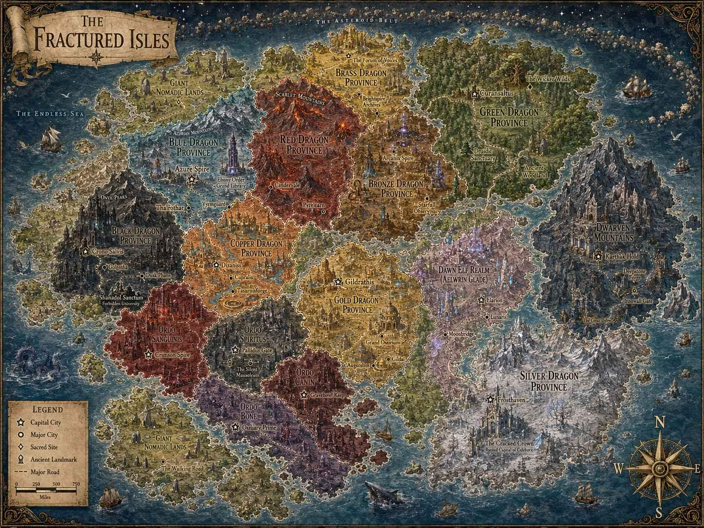

# Fractured Isle Wiki
Lovingly crafted as the brainchild of [Cpt-Cabinet](https://github.com/Cpt-Cabinet)

Wiki support provided by [IJordano478](https://github.com/IJordano478)

[Link to the Wiki](https://paranoidandroid98.github.io/Fractured-Isle-Wiki/)

    

           

### Quartz v5

> “[One] who works with the door open gets all kinds of interruptions, but [they] also occasionally gets clues as to what the world is and what might be important.” — Richard Hamming

Quartz is a set of tools that helps you publish your [digital garden](https://jzhao.xyz/posts/networked-thought) and notes as a website for free.

🔗 Read the documentation and get started: https://quartz.jzhao.xyz/

[Join the Discord Community](https://discord.gg/cRFFHYye7t)

#### Sponsors

  

